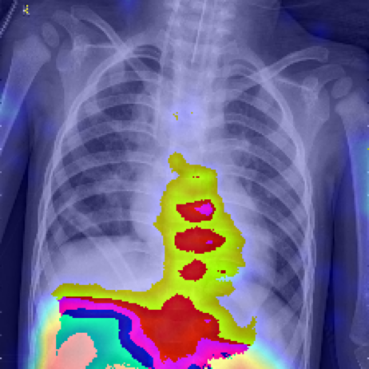

# 🫁 Pneumonia Detection using CNN + Grad-CAM

Deep Learning project for detecting Pneumonia from Chest X-ray images using Convolutional Neural Networks (CNN).

## 🚀 Features

- Pneumonia Detection from Chest X-rays
- CNN-based image classification
- Grad-CAM Explainability
- Hugging Face Deployment
- Medical Image Analysis

## 📊 Model Performance

- Validation Accuracy: **95.6%**
- Test Accuracy: **91.5%**

## 🧠 Technologies Used

- TensorFlow / Keras
- OpenCV
- NumPy
- Gradio
- Hugging Face Spaces

## 🌐 Live Demo

https://pratham124-pneumonia-detection-cnn.hf.space

## 📷 Grad-CAM Visualization

## 📌 Future Improvements

- Reduce shortcut learning
- Add lung segmentation
- Improve dataset diversity
- Experiment with EfficientNet/ResNet
